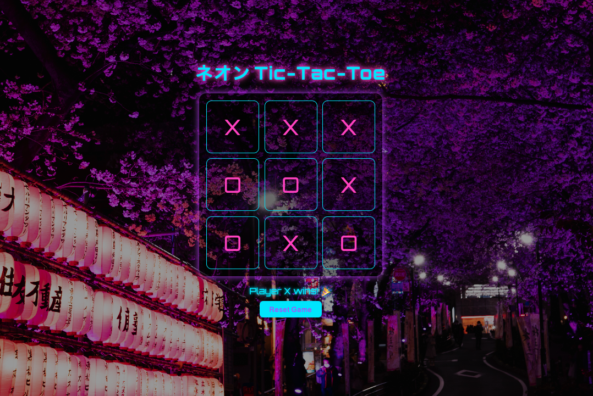

# 🎮 Neon Tic-Tac-Toe

A glowing, Tokyo inspired Tic-Tac-Toe game built using beginner-friendly HTML, CSS, and JavaScript.

---

## Goal of the Game

The classic **Tic-Tac-Toe**:  
- Two players take turns marking `X` and `O` on a 3×3 grid.
- The first to align three of their marks **horizontally**, **vertically**, or **diagonally** wins.
- If all spaces are filled without a winner, the game ends in a draw.

---

## How It Was Built

This project was created using just **three files**:
- `index.html` for layout and structure.
- `style.css` for a **neon cyberpunk style**, inspired by Tokyo at night.  
  It uses a background image (`modern-tokyo.jpg`) and glowing UI effects.
- `script.js` for game logic, handling:
  - Turn-based play
  - Win condition checking
  - Draw detection
  - Game reset

Designed with **beginners in mind**: simple, readable, and easy to customize or expand.

---

## Contributions Welcome!

Want to:
- Add multiplayer support?
- Improve accessibility?
- Animate the board?
- Add sound effects or themes?

Feel free to fork the repo and open a pull request.  
**All skill levels welcome.** 

---

## Final Result

The game features a neon board, animated hover effects, and a background straight from a Tokyo night scene:

---

## Assets

- Background: `modern-tokyo.jpg`
- Screenshot: `x.png`
- Fonts: [Orbitron](https://fonts.google.com/specimen/Orbitron)

---

Happy coding! ✨
